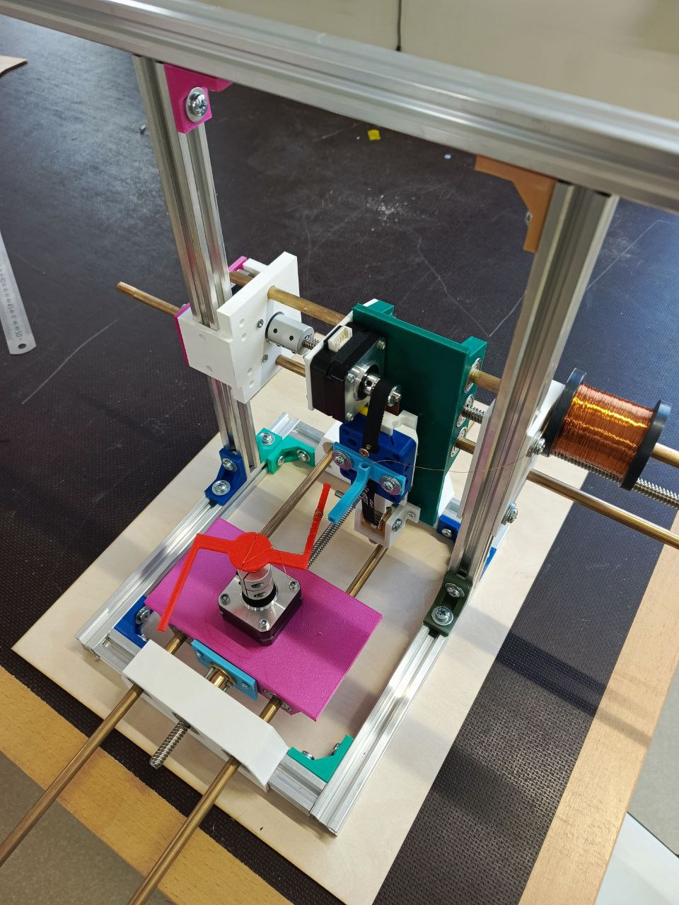
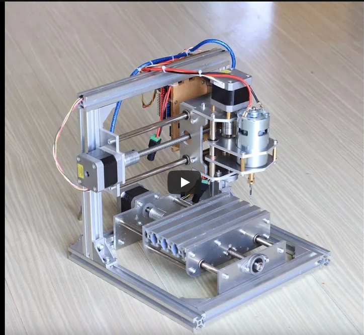
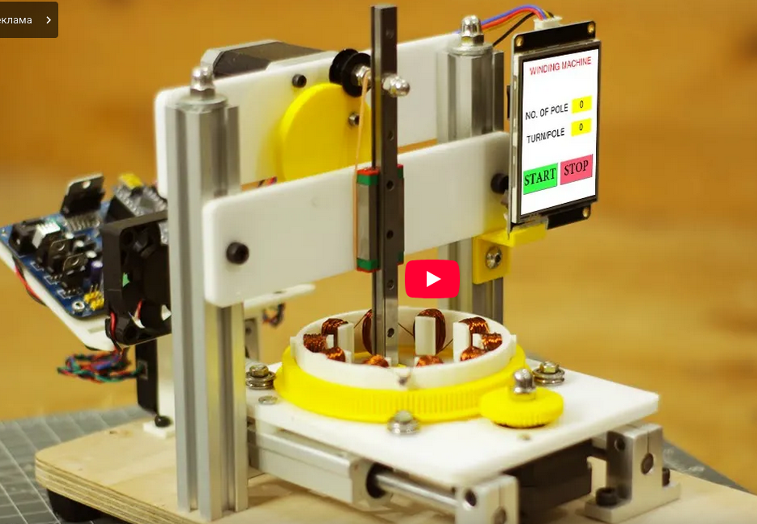

# Намотчик

Видео демонстрации работы приведено в 

## Команда
1. **Мишуринских Михаил**  
   - Email: mishurinskikh.mn@phystech.edu  
   - Telegram: [@mis246](https://t.me/mis246)  
   - Роль: проектирование деталей, сборка  

2. **Новосёлов Ярослав**  
   - Email: novoselov.iav@phystech.edu  
   - Роль: написание управляющей программы, проектирование деталей  

## Причины выбора проекта
Большие возможности для практического применения проекта, его универсальность.

## Достигнутая цель
Создано устройство для автоматической намотки проволоки на звукосниматели и другие объекты

## Задачи
1. Проектирование необходимых деталей: 
   - Угловые соединители алюминиевых профилей
   - Держатели для ходовых винтов
   - Вертикальная и горизонтальная платформы
   - Устройство для натяжения ремня
   - Держатели для двигателей
   - Рельса для вертикального движения прицеливающего устройства
2. Сборка корпуса из напечатанных деталей, алюминиевых профилей
3. Установка платформ, организация их движения при помощи ходового винта
4. Создание коробки для электроники
5. Написание управляющей программы
6. Настройка и тестирование устройства

## Описание устройства
Устройство напоминает по устройству 3D-принтер: оно состоит из прицеливающего устройства, которое способно перемещаться по трём осям над объектом (катушкой или звукоснимателем) и наматывать на него проволоку. 

**Конструкция:**
- Корпус состоит из двух рамок: вертикальной и горизонтальной.
- Над горизонтальной рамкой находится платформа с шаговым двигателем, закрепленная с применением ходового винта (перемещается по горизонтальной оси).
- Вертикальная платформа закреплена на другом ходовом винте и перемещается по оси, перпендикулярной нижней платформе.
- На платформе расположен электродвигатель, перемещающий ремень с кареткой и прицеливающим устройством.
- Для натяжения ремня используется специальное приспособление.

**Принцип работы:**  
Конструкция позволяет прицеливающему устройству вращаться вокруг объекта (закрепленного на двигателе) и наматывать на него проволоку.

## Описание процесса решения задач
1. **Создание корпуса:**
   - Напечатаны держатели для ходового винта (`three`, `three_up` в репозитории).
   - Напечатаны угловые соединители (`angle`), собран корпус из алюминиевых профилей.
2. **Установка платформ:**
   - Напечатаны платформы (`plate`, `plate_up`), держатель для двигателя (`holder`).
   - Установлены на корпус с использованием ходового винта и латунных балок.
3. **Система с ремнем:**
   - Напечатаны рельса (`rail`), каретка (`carriage`), натягивающее устройство (`fixskiv`, `fixfixskiv`).
   - Закреплен ремень, достигнуто перемещение каретки при вращении двигателя.
4. **Электроника:**
   - Создана коробка для электроники.
5. **Программирование:**
   - Написан код для движения каретки (лежит в репозитории).
6. **Тестирование:**
   - Напечатан образец звездочки для намотки.
   - Создана тестовая программа для демонстрации работы.

## Существующие аналоги и альтернативы
1. [Видео с подобной системой перемещения каретки](https://youtu.be/BMVNzjB5hds?si=kCWIetpFhRKtm2jW)
2. [Видео с похожей конструкцией](https://youtu.be/jD39MupZx00?si=GmyoavpNxICr1N5V)
3. [Статья с другим дизайном намотчика](https://3dtoday.ru/blogs/alkutepov/kak-ya-sobiral-namotocnyi-stanok-dlya-namotki-katusek-zvukosnimatelei)

  
  

### Отличия проекта от аналогов:
- Использование системы с ремнем для вертикального перемещения каретки (высокая скорость).
- Возможность легкого переконструирования под конкретные задачи.
- Намотка с внешней стороны звездочки (в аналогах — с внутренней).

### Недостатки и доработки:
- Требуется подбор параметров намотки.
- Необходима панель управления.
- Улучшение внешнего вида.